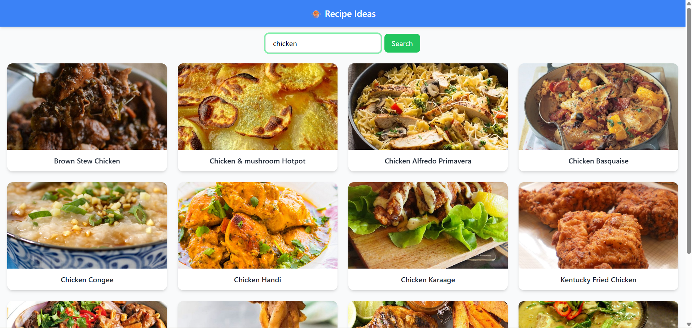

# 🍲 Recipe Ideas App

A simple and responsive web application that lets users search for recipes by ingredient using the [TheMealDB API](https://www.themealdb.com/).  

This project was built as part of an interview assignment.  

---

## ✨ Features

- 🔎 **Search recipes** by ingredient (e.g., "chicken", "rice", "tomato").  
- 📸 **Recipe cards** with images and titles.  
- 📱 **Responsive design** (works on mobile & desktop).  
- ⚡ **Error handling** for no results, invalid input, or network issues.  
- 🎨 **Clean UI** with TailwindCSS styling.  

---

## 🛠️ Tech Stack

- **React** (frontend framework)  
- **TailwindCSS** (styling & responsiveness)  
- **TheMealDB API** (recipe data source)  

---

## 📂 Project Structure

src/
├── components/
│ ├── SearchBar.jsx
│ ├── RecipeCard.jsx
│ ├── RecipeGrid.jsx
│
├── pages/
│ └── Home.jsx
│
├── App.jsx
└── index.js

## 📸 Screenshots

1. Before Search

2. After Search

## 🤖 LLM Assistance

This project was developed with the assistance of a Large Language Model (ChatGPT).  
The LLM was used to:
- Debug configuration issues with TailwindCSS (v4) and PostCSS.  
- Guide setup and deployment on CodeSandbox.  

By leveraging an LLM, the development process was faster and more reliable, ensuring best practices were followed.

## ✅ Future Improvements

If given more time, the app can be extended with:

📖 Recipe details page (ingredients, cooking instructions, YouTube link).

⭐ Save favorites (store in local storage).

🎲 Random recipe generator.

🌍 Filter by cuisine or category.

## 👨‍💻 Author
Developed by Shivam Goel ✨
